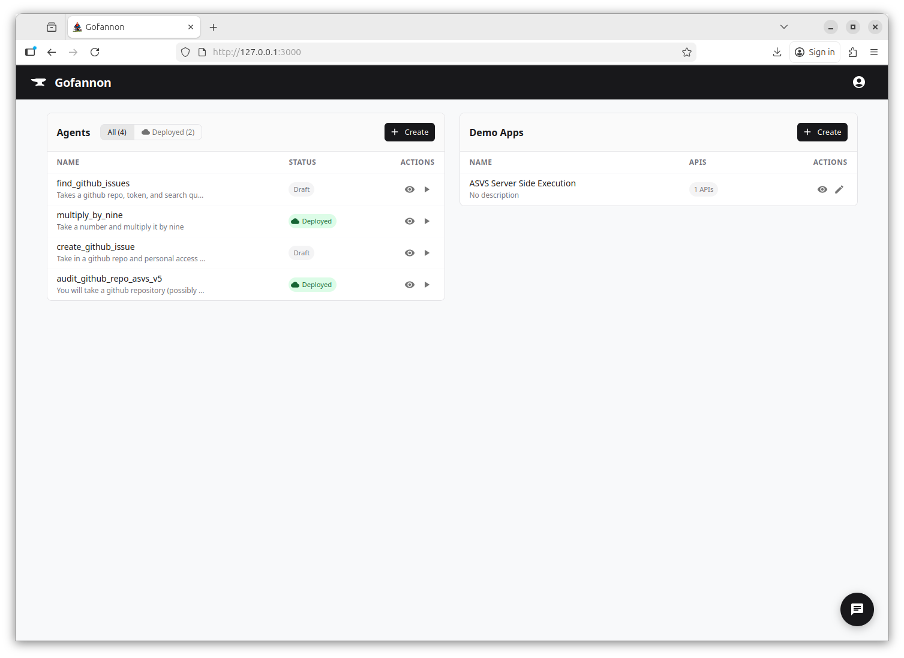
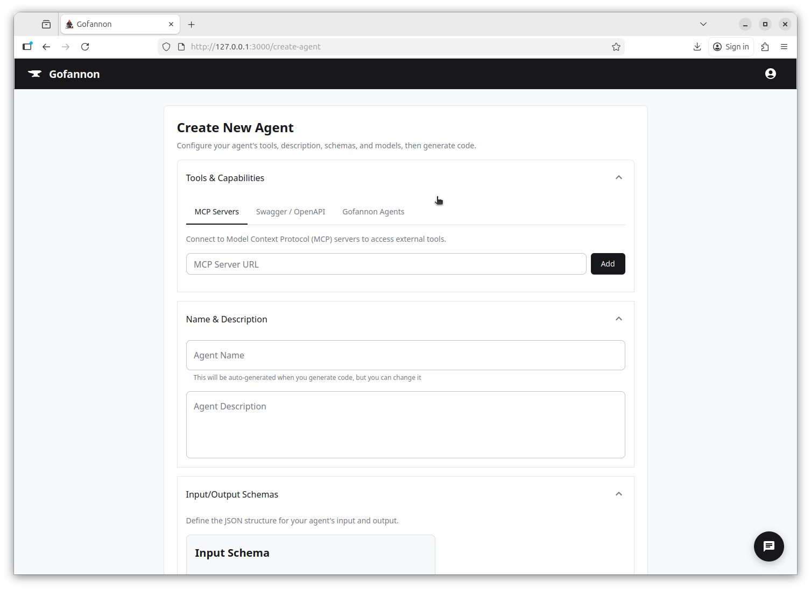
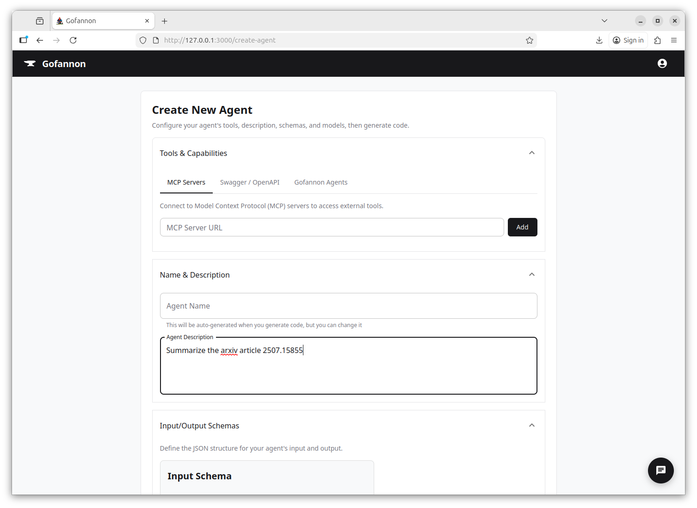
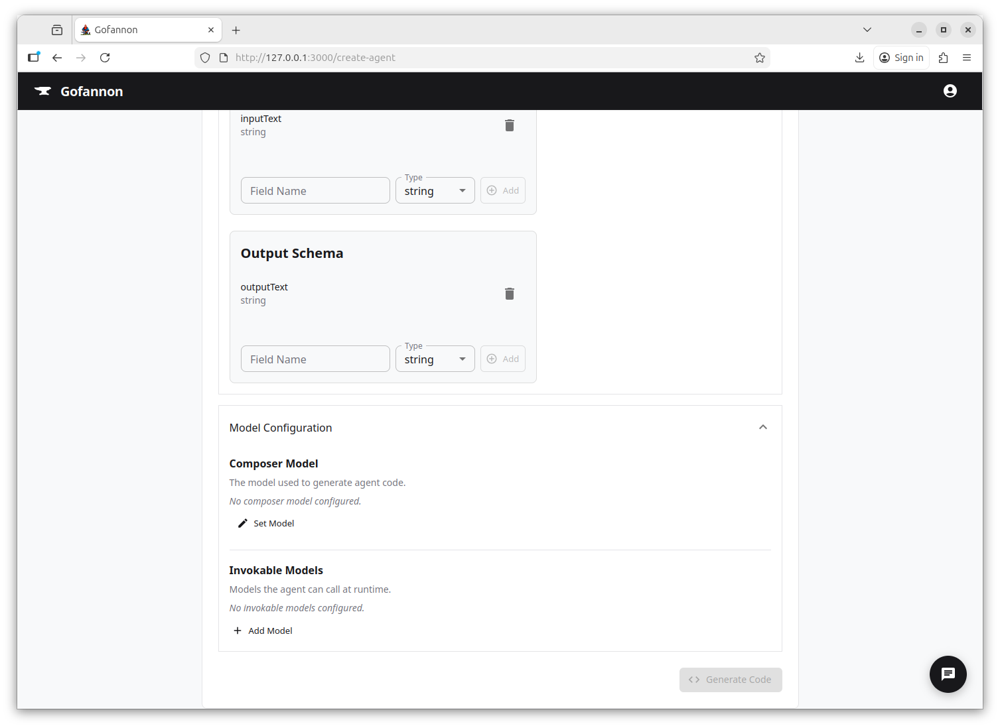
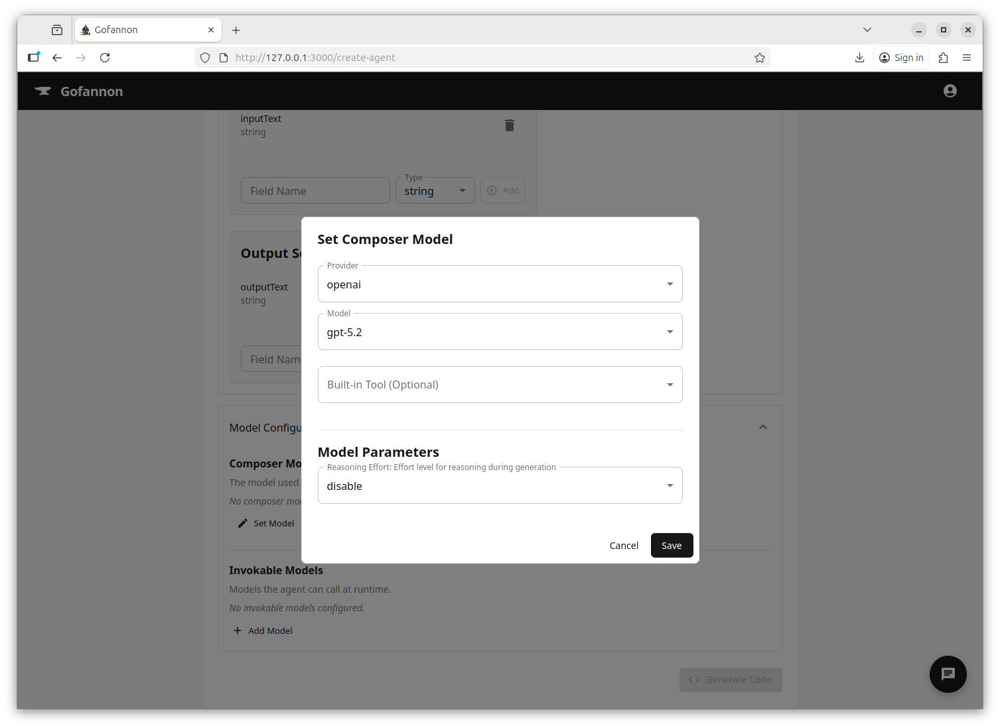
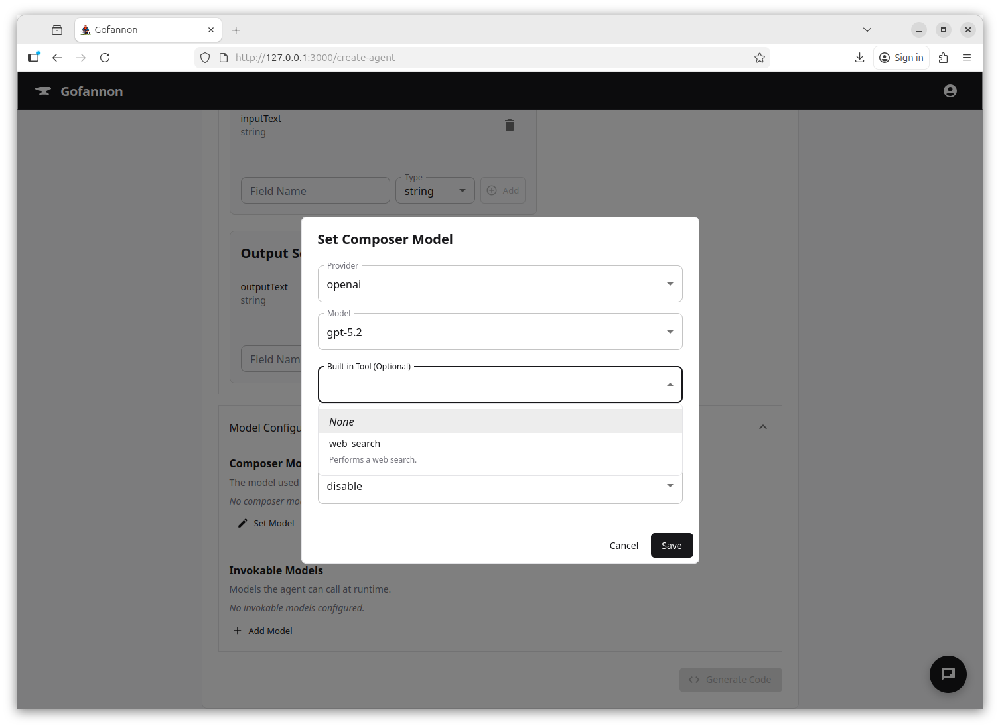
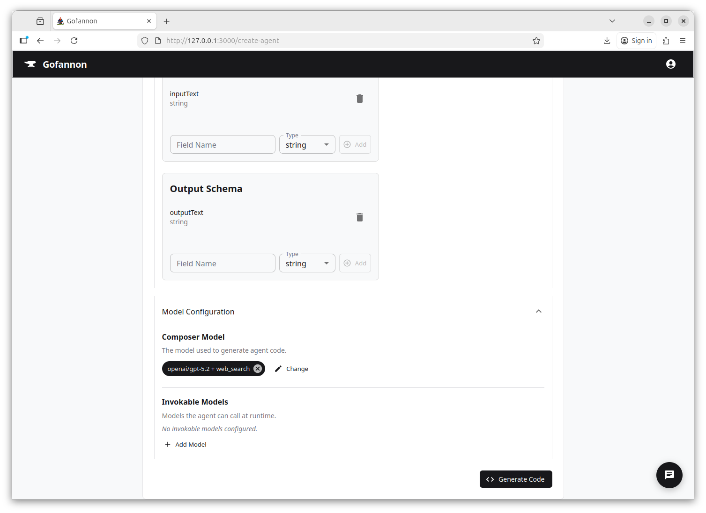
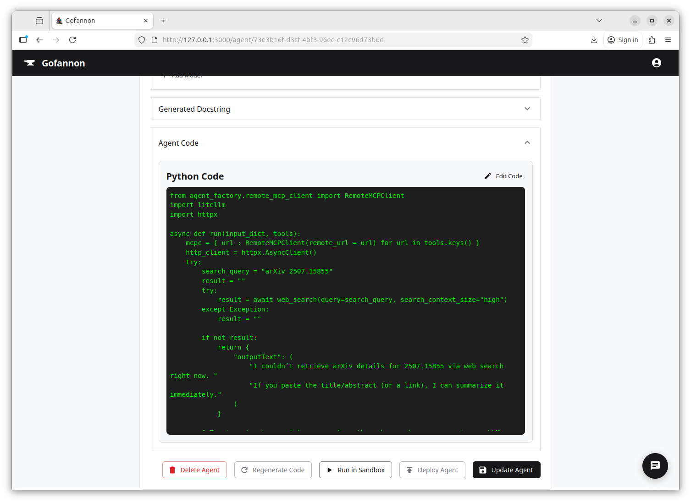
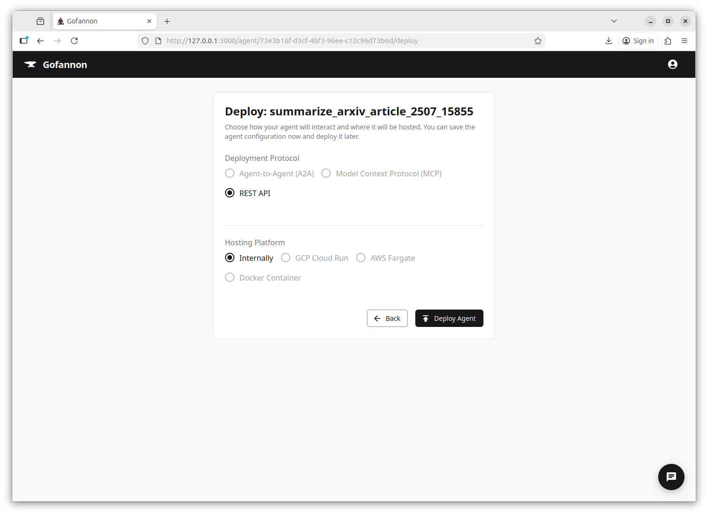

# Gofannon Quickstart

## Install
```bash
git clone https://github.com/The-AI-Alliance/gofannon.git
cd gofannon/webapp/infra/docker
```
Add `webapp/infra/docker/.env` file with these contents:
```bash
# Only one provider is required. We're all biased and have our personal favorites, we won't force you to choose, here are a few popular ones. 
OPENAI_API_KEY=sk-proj-your-key
ANTHROPIC_API_KEY=sk-ant-your-key
GEMINI_API_KEY=...

# This will be for a locally running CouchDB Instance that will persist your agents and demos between runs. 
COUCHDB_USER=admin
COUCHDB_PASSWORD=password
```
```bash
docker-compose up --build
```
### Rebuild after pulling new work from `main`
```
cd gofannon/webapp/infra/docker
docker-compose down && docker-compose up -d --build
```

## Visit app
http://127.0.0.1:3000/


## Create agent


### Choose tools if needed
* MCP server by URL
* Swagger spec by file or URL
* Agents and tools already deployed on this Gofannon instance

### Add description (prompt)


## Choose compose and invokable models

### Set model


### Choose provider, model, params


### Optionally select built-in tool


### Model set


## Generate/re-generate code


## Run in sandbox

### Enter prompt


### Results

## Save/update agent


## Deploy agent

